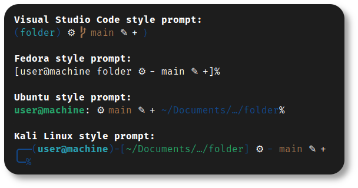

<h1 align="center">
	
	<br>Fedora Setup<br>
</h1>
<p align="center">
	<a href="https://github.com/nico-castel/Fedora-Setup/commits"></a>
	<a href="https://github.com/nico-castell/Fedora-Setup/releases"></a>
	<a href="LICENSE"></a>
	<a href="https://github.com/nico-castell/Fedora-Setup"></a>
</p>

<h2 align="center">How to use</h2>

I'm assuming you have just installed [fedora](https://getfedora.org/en/workstation/download/)
successfully.

1. Close this repo, you can do a shallow clone if you wish (by adding `--depth=1` to the following
	command).
	```shell
	$ git clone https://github.com/nico-castell/Fedora-Setup.git
	```
2. (Optional) The `main` branch is always under development. If you want to use the latest stable
	version (which will be tagged), use the following commands:
	```shell
	$ git checkout $(git describe --tags --abbrev=0) # Go to the last tag
	$ git checkout main                              # Go back to main
	```
3. (Optional) Look at the instuctions in the [gnome_apperance.sh](scripts/gnome_appearance.sh)
	script, and configure the file structure for the script to set up the GNOME appearance with your
	themes.
	```
	scripts
	└── themes
	    ├── background
	    │   └── image.png
	    ├── cursor
	    │   └── cursor.tar.gz
	    ├── icons
	    │   └── icons.tar.gz
	    └── theme
	        └── theme.tar.gz
	```
4. (Optional) If you plan on building a [minecraft server](scripts/mc_server_builder.sh), you should
	check that the `$download_link` and `$version` variables are up to date.
5. Run the [fedora_setup.sh](fedora_setup.sh) script.
	```shell
	$ cd /path/to/cloned_repo
	$ ./fedora_setup.sh
	$ ./fedora_setup.sh -f # Load package choices from temporary file
	```
	The first thing the script will do is ask for your sudo password. (It's needed to install
	packages, write to `/etc/profile.d`, configure `ufw` and a few more things). Do **not** run it as
	sudo (`sudo ./fedora_setup.sh`).
6. Follow the instructions asked by the script.
7. Wait, (yes, I know it sounds boring) as the script runs, it can, and will, prompt for further
	instructions.

<h2 align="center">Keep in mind</h2>

- You **must** have an internet connection to run the script.
- The script has no support for NVIDIA, meaning no drivers, no configurations, nothing, nada.

<h2 align="center">Biggest features</h2>

This project can set up some powerful features, such as:

- Advanced, stylized prompts for the **Z-Shell**:
	<p align="center"></p>
- Powerline plugin for the **Vim** editor:
	<p align="center"></p>
- Setting up **GnuPG** to sign **Git** commits:
	<p align="center"></p>
- An easily expandable list of packages for the script to install: [packages.txt](packages.txt)
- Desktop entry files that you can add at your convenience.
- A [script](scripts/systemdboot_switch.sh) to switch from **grub** to **systemd-boot**.
- A [script](scripts/mc_server_builder.sh) to set up a minecraft server.
- A [script](back_me_up.sh) to back up your home directory.

<h2 align="center">Known issues</h2>

1. [duc_noip_install.sh](scripts/duc_noip_install.sh): The installer can't seem to understand
	symbols when typing a password in the terminal, at least on my tests, this script opens *gedit*
	for you to copy/paste your password and work around the issue.
2. [mc_server_builder.sh](scripts/mc_server_builder.sh): The link to download the latest version of
	the server must be manually updated for every minecraft release. You'll find the download_link and
	version under a TODO in the script.

<h2 align="center">About</h2>

This project started as a heavily reworked version of
[Pop!_OS Setup](https://github.com/nico-castell/PopOS-Setup), adapted to work in
[Fedora](https://getfedora.org/en/workstation/download/).

This repository, and all contributions to this repository, are under the [MIT License](LICENSE).
This software can also install software under different licenses, this project's license doesn't
apply to them, refer to the license of that software.

> *Live long, and prosper.*  
> *Spock*
